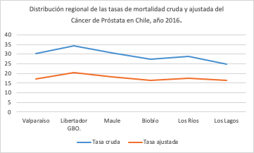

El cáncer de próstata (**Figura 1**) es uno de los tipos de cáncer más frecuentes en la población masculina a nivel mundial. Representa el tumor no cutáneo más diagnosticado en hombres y constituye una de las principales causas de mortalidad por cáncer en varones [1]. Su incidencia aumenta significativamente con la edad, observándose la mayoría de los casos en hombres mayores de 65 años. En numerosos países, las tasas de mortalidad por cáncer de próstata han mostrado una tendencia a la disminución durante las últimas décadas, lo que se atribuye en parte a mejoras en las estrategias de detección precoz y al avance en las alternativas terapéuticas disponibles [2].

  
  
<b>Figura 1: Ubicación anatómica de la próstata en la pelvis masculina.</b>

En Chile, el cáncer de próstata representa una importante carga sanitaria y corresponde a la tercera causa de muerte por cáncer en hombres. Según datos epidemiológicos nacionales, la tasa de mortalidad ajustada registrada durante el año 2016 fue de 15,65 por cada 100.000 habitantes. Sin embargo, existen diferencias regionales significativas. Algunas regiones presentan tasas superiores al promedio nacional, destacando Valparaíso (17,06), Libertador General Bernardo O’Higgins (20,27), Maule (18,35), Biobío (16,53), Los Ríos (17,59) y Los Lagos (16,54 por 100.000 habitantes), como se muestra en **Figura 2** [3].

  
  
<b>Figura 2: Distribución regional de las tasas de mortalidad cruda y ajustada por cáncer de próstata en Chile (2016).</b>

## Diagnóstico del cáncer de próstata

El diagnóstico del cáncer de próstata generalmente comienza mediante pruebas de pesquisa y evaluaciones clínicas. Una de las herramientas más utilizadas es la medición en sangre del antígeno prostático específico (PSA). Niveles elevados de PSA pueden sugerir la presencia de un carcinoma prostático en etapas iniciales. No obstante, esta prueba carece de especificidad absoluta, ya que valores elevados también pueden observarse en condiciones benignas como la hiperplasia prostática benigna o procesos inflamatorios de la próstata.

Por esta razón, la interpretación del PSA debe realizarse considerando múltiples factores clínicos, entre ellos la edad del paciente, la densidad del PSA y la velocidad de incremento del marcador en el tiempo. Además, suele complementarse con el examen digital rectal, que permite detectar irregularidades en la superficie prostática o áreas de induración sospechosas [4].

Cuando los hallazgos clínicos sugieren la presencia de malignidad, el diagnóstico definitivo se confirma mediante una biopsia prostática. Este procedimiento consiste en la obtención de múltiples muestras de tejido prostático que posteriormente son analizadas mediante examen histopatológico. El análisis microscópico permite confirmar la presencia de células tumorales y evaluar el grado de agresividad del cáncer mediante el **sistema de Gleason**, el cual clasifica el tumor según la arquitectura glandular observada. Esta clasificación proporciona información pronóstica relevante sobre el comportamiento biológico del tumor y su posible evolución clínica [5].

## Rol de las imágenes médicas

La imagenología cumple un papel fundamental tanto en el diagnóstico como en la estadificación del cáncer de próstata. La ecografía transrectal es una técnica ampliamente utilizada para guiar biopsias prostáticas, aunque presenta limitaciones en la detección directa de lesiones tumorales.

En contraste, la resonancia magnética multiparamétrica (RMmp) ha demostrado una mayor capacidad para identificar lesiones sospechosas dentro de la próstata y evaluar la extensión local del tumor. Esta técnica combina múltiples secuencias de imagen que permiten caracterizar mejor el tejido prostático y facilita la realización de biopsias dirigidas hacia áreas con mayor probabilidad de malignidad.

En etapas más avanzadas de la enfermedad, otros estudios de imagen como la tomografía computarizada (TC) y la gammagrafía ósea pueden utilizarse para detectar la presencia de metástasis, particularmente en pacientes clasificados como de alto riesgo [6].

**Síntesis**

El diagnóstico temprano del cáncer de próstata se basa en la integración de múltiples herramientas clínicas y diagnósticas. La combinación de marcadores bioquímicos, evaluación clínica e imágenes médicas permite detectar la enfermedad en fases iniciales y caracterizar su agresividad. Esta información resulta fundamental para seleccionar la estrategia terapéutica más adecuada y optimizar el manejo clínico de los pacientes.

---

[← Inicio](index.html) | [Siguiente: Tratamiento del cáncer →](02_tratamiento_cancer.html)
