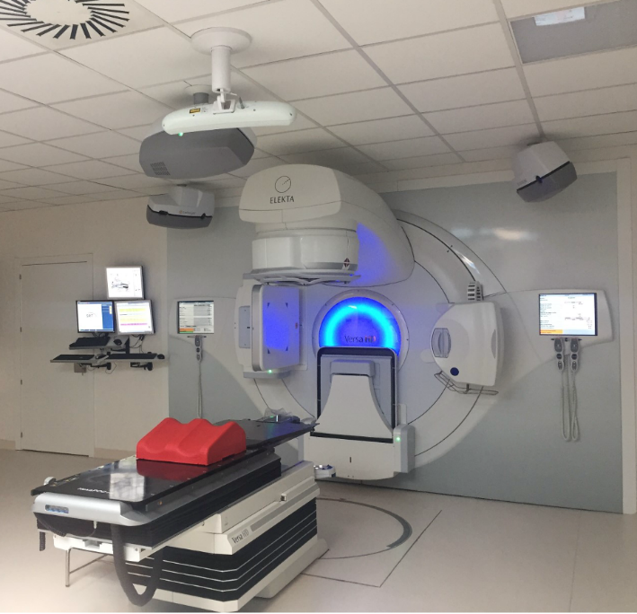

# Tratamiento del cáncer

El abordaje terapéutico del cáncer de próstata –y de los procesos oncológicos en general– suele requerir un manejo multidisciplinario que puede incluir cirugía, radioterapia y terapias sistémicas (como hormonoterapia, quimioterapia o inmunoterapia), según las características de la enfermedad y el paciente. En particular, la radioterapia destaca como una modalidad fundamental en el control locoregional del cáncer: se estima que aproximadamente la mitad de todos los pacientes con cáncer podrían beneficiarse de la radioterapia en alguna etapa de su tratamiento[7]. En el contexto del cáncer de próstata localizado, la radioterapia constituye una alternativa curativa equivalente a la cirugía (prostatectomía radical), y también se emplea de forma complementaria tras cirugía (terapia adyuvante) o para tratar recidivas locales (terapia de rescate) [8].

## Conceptos de radioterapia

La radioterapia (RT) consiste en la administración controlada de radiación ionizante con el objetivo de destruir las células tumorales, procurando a la vez minimizar el daño a los tejidos sanos circundantes. Este principio terapéutico se basa en la mayor sensibilidad a la radiación que presentan las células cancerosas en comparación con las células normales, especialmente aquellas neoplásicas con alta tasa de proliferación. 

En función del objetivo clínico, la radioterapia puede emplearse con distintas intenciones [9], señaladas en la Tabla 1:

**Tabla 1. Funciones de la radioterapia según objetivo clínico**

| Objetivo | Descripción |
|---------|-------------|
| **Tratamiento curativo (radical)** | Busca la erradicación completa del tumor y la curación del paciente. Por ejemplo, un carcinoma de próstata localizado de riesgo intermedio o alto puede tratarse con radioterapia externa conformada de alta precisión (e.g., IMRT/VMAT con guía por imágenes) con intención curativa. |
| **Terapia adyuvante** | Se administra después de un tratamiento primario (cirugía) para eliminar microscópicos focos residuales y reducir el riesgo de recurrencia. Un caso típico es la radioterapia postoperatoria en cáncer de mama para eliminar células remanentes en la pared torácica. |
| **Terapia neoadyuvante** | Se emplea antes de la intervención quirúrgica con el objetivo de reducir el tamaño tumoral y facilitar una cirugía subsiguiente más conservadora o efectiva (p.ej., radioterapia preoperatoria en cáncer de recto localmente avanzado). |
| **Terapia paliativa** | Orientada no a curar, sino a aliviar síntomas y mejorar la calidad de vida en enfermedad metastásica o incurable (por ejemplo, radioterapia sobre metástasis óseas dolorosas para aliviar el dolor). |

Estas distintas finalidades ilustran la versatilidad de la radioterapia en oncología. Dependiendo del caso, la dosis total administrada y la fraccionación (tamaño de dosis por sesión y número de sesiones) variarán. En escenarios curativos, las dosis tienden a ser altas (70-80 Gy en próstata, típicamente fraccionadas en 35-40 sesiones de ~2 Gy), mientras que en contextos paliativos se usan esquemas abreviados (por ejemplo 20 Gy en 5 sesiones) enfocados en el control sintomático. Un Gray (Gy) equivale a la absorción de un joule de energía por kilogramo de material irradiado [10].

## Radiación ionizante y mecanismos de acción celular

La radiación ionizante, utilizada en radioterapia, incluye partículas y fotones con suficiente energía para ionizar átomos y moléculas, lo que permite dañar estructuras celulares clave, especialmente el ADN. La radiación puede generar daños directos sobre la doble hélice o indirectos a través de radicales libres producidos por la radiólisis del agua intracelular. Este último mecanismo es predominante en radiaciones de bajo LET (Linear Energy Transfer), como los rayos X y gamma. Por el contrario, las radiaciones de alto LET, como protones y partículas pesadas, producen mayor daño directo al ADN. Las roturas de doble hebra son las lesiones más críticas, ya que, si no son correctamente reparadas, conducen a la muerte celular o a mutaciones potencialmente oncogénicas. La presencia de oxígeno durante la irradiación incrementa la eficacia del tratamiento, ya que estabiliza el daño inducido por radicales libres, fenómeno conocido como efecto oxígeno [11], [12].

La respuesta celular a la radiación está modulada por factores como la fase del ciclo celular, la capacidad de proliferación y la cinética de reparación. Las células tumorales, debido a su alta tasa de división y menor capacidad reparadora, suelen ser más radiosensibles que los tejidos normales, lo que sustenta la eficacia terapéutica de la radioterapia. Sin embargo, tejidos sanos con alta tasa de renovación, como mucosas y piel, también son susceptibles al daño, lo que limita las dosis administrables. Estos principios han guiado el desarrollo de esquemas de fraccionamiento y técnicas avanzadas de planificación que buscan maximizar la dosis en el tumor mientras minimizan la exposición a los órganos sanos, optimizando así la relación riesgo-beneficio del tratamiento radioterapéutico [13].

## Técnicas de radioterapia

La radioterapia ha experimentado una evolución notable desde sus inicios, pasando de técnicas convencionales bidimensionales a métodos tridimensionales altamente conformados. Las primeras aplicaciones clínicas se basaron en la radioterapia externa (teleterapia) mediante máquinas de rayos X ortovoltage y fuentes de cobalto-60, que ofrecían una cobertura limitada y escasa capacidad para adaptarse a la anatomía del paciente. El desarrollo de los aceleradores lineales y la incorporación de la tomografía computarizada (CT) a la planificación permitieron la transición hacia la radioterapia tridimensional conformada (3D-CRT), mejorando la precisión en la entrega de dosis y reduciendo la exposición innecesaria a órganos sanos adyacentes[14].

  
  
<b>Figura 3:</b> Acelerador Versa HD de Elekta para tratamientos IGRT, VMAT y SBRT.

En la 3D-CRT, la radiación es conformada a la geometría del tumor utilizando múltiples haces desde distintos ángulos, apoyados por colimadores multilámina (MLC) que ajustan automáticamente la forma del haz. Esta técnica fue un avance clave sobre la radioterapia 2D, permitiendo escalar la dosis tumoral sin incrementar de manera significativa la toxicidad sobre tejidos normales. La radioterapia con electrones se consolidó como una modalidad complementaria, especialmente útil en el tratamiento de lesiones superficiales, gracias a su limitada penetración y bajo impacto en estructuras profundas [15].

El desarrollo de técnicas avanzadas como la radioterapia de intensidad modulada (IMRT) supuso un salto significativo en la capacidad de adaptar la distribución de dosis. A través de la modulación dinámica del haz en cada campo, IMRT permite esculpir la dosis alrededor de estructuras críticas, optimizando la cobertura tumoral y minimizando la toxicidad. Esta técnica se planifica mediante algoritmos inversos que ajustan automáticamente la intensidad de cientos de subcampos para alcanzar los objetivos prescritos [16]. 

Posteriormente, la arcoterapia volumétrica modulada (VMAT) perfeccionó los principios de IMRT, permitiendo administrar tratamientos complejos en arcos continuos alrededor del paciente. VMAT reduce considerablemente los tiempos de tratamiento y mejora la eficiencia clínica sin sacrificar calidad dosimétrica [17]. Gracias a su capacidad de modulación simultánea del colimador, la velocidad de rotación y la tasa de dosis, VMAT se ha consolidado como una de las técnicas estándar en oncología radioterápica moderna, con aplicaciones destacadas en cánceres de próstata, cabeza y cuello.

La incorporación de la radioterapia guiada por imágenes (IGRT) ha sido fundamental para mejorar la precisión diaria del tratamiento. La variación anatómica interfraccional y el movimiento respiratorio son desafíos relevantes que IGRT ayuda a controlar mediante la adquisición de imágenes durante la sesión de tratamiento, como radiografías, ultrasonido o tomografía de haz cónico (CBCT) [18]. La capacidad de verificar y corregir la posición del tumor en tiempo real ha permitido reducir márgenes de seguridad y mejorar la relación dosis-tumor/tejido sano. En combinación con IMRT y VMAT, IGRT garantiza la precisión necesaria para administrar tratamientos altamente conformados con seguridad [19].

Otras técnicas de alta precisión como la radioterapia estereotáctica corporal (SBRT) y la protonterapia amplían las opciones disponibles para casos seleccionados. La SBRT permite administrar dosis ablativas en pocas fracciones con precisión submilimétrica, logrando resultados comparables a la cirugía en tumores pequeños como el cáncer de pulmón temprano [20]. Por su parte, la protonterapia ofrece distribuciones de dosis más favorables gracias al fenómeno del pico de Bragg, lo que permite proteger estructuras críticas y es especialmente útil en pediatría y tumores cercanos a órganos sensibles [21]. Finalmente, la braquiterapia sigue siendo esencial en varios tipos de cáncer, proporcionando una de las distribuciones de dosis más conformadas disponibles y resultados superiores en patologías como el cáncer de cérvix y próstata [22].

Las principales técnicas modernas de radioterapia y sus características se resumen en la **Tabla 2**.

**Tabla 2. Resumen de características de técnicas de radioterapia**

| Técnica | Características principales y aplicaciones |
|---|---|
| **Radioterapia 3D conformada (3D-CRT)** | Radioterapia externa convencional con haces de fotones estáticos conformados mediante colimadores al volumen tumoral. Utiliza imágenes tridimensionales (CT) para planificar campos que se adaptan a la forma del tumor, reduciendo la dosis a tejidos adyacentes en comparación con la radioterapia bidimensional (RT2D). Constituye la base a partir de la cual se desarrollaron las técnicas de modulación. Se emplea en numerosos tumores sólidos, aunque puede irradiar mayor volumen de tejido sano que las técnicas más modernas. |
| **Radioterapia de intensidad modulada (IMRT)** | Técnica avanzada en la cual la intensidad del haz se modula dinámicamente dentro de cada campo mediante colimadores multilámina. Permite distribuir la dosis con alta conformidad alrededor de estructuras críticas, adaptando el perfil de dosis al volumen tumoral y reduciendo la irradiación de órganos de riesgo. Requiere planificación inversa computarizada. Se utiliza en tumores de cabeza y cuello, próstata, sistema nervioso central y tumores ginecológicos, entre otros. |
| **Arcoterapia volumétrica modulada (VMAT)** | Variante de IMRT en la que la radiación se administra mientras el acelerador lineal rota alrededor del paciente describiendo arcos continuos de hasta 360°. Durante la rotación se modulan simultáneamente la intensidad del haz, la forma del campo y la velocidad del gantry. Permite tratamientos complejos con alta precisión dosimétrica en tiempos de sesión más cortos que IMRT convencional. |
| **Radioterapia guiada por imágenes (IGRT)** | Conjunto de técnicas de verificación mediante imagen durante el tratamiento. Utiliza radiografías digitales, tomografía computarizada de haz cónico u otros sistemas para confirmar la posición del paciente y del volumen tumoral antes de cada sesión. Permite reducir márgenes de seguridad y aumentar la precisión del tratamiento, especialmente en tumores móviles o cercanos a órganos críticos. |
| **Radioterapia esterotáxica corporal (SBRT / SABR)** | Técnica de altísima precisión que administra dosis elevadas en un número reducido de fracciones (generalmente entre 1 y 5). Requiere sistemas de inmovilización rígida e IGRT para garantizar errores menores a 2 mm. Indicada en lesiones pequeñas, típicamente menores de 5 cm, en pulmón, hígado, columna o próstata. Puede alcanzar tasas de control local comparables a la cirugía en algunos escenarios clínicos. |
| **Protonterapia** | Modalidad de radioterapia que utiliza protones acelerados en lugar de fotones. Los protones depositan la mayor parte de su energía en el denominado pico de Bragg, lo que permite concentrar la dosis en el tumor y reducir la irradiación de tejidos sanos más allá del volumen objetivo. Se emplea especialmente en tumores pediátricos, tumores de base de cráneo y otras localizaciones cercanas a órganos sensibles. |
| **Braquiterapia** | Radioterapia interna que consiste en la colocación de fuentes radiactivas directamente en el tumor o en cavidades próximas. Permite administrar dosis muy altas localmente con un gradiente de caída rápido en tejidos circundantes. Se utiliza en cáncer de cérvix, endometrio, próstata, mama, piel y otras localizaciones, ya sea como tratamiento único o combinado con radioterapia externa. Puede aplicarse en modalidades de alta tasa (HDR) o baja tasa (LDR). |
