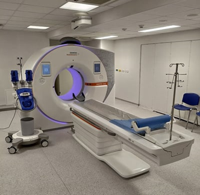

# Modalidades de adquisición de imágenes

La imagenología médica es pilar fundamental en todas las etapas de la radioterapia, desde la planificación hasta la administración. En la planificación radioterápica, la modalidad de imagen por excelencia es la **tomografía computarizada (CT)** (**Figura 5**), debido a que proporciona no solo visualización anatómica en tres dimensiones sino también valores de densidad electrónica (**unidades Hounsfield**) necesarios para calcular con precisión la absorción de la radiación en los tejidos [25]. 

  
  
<b>Figura 5:</b> Ejemplo de CT Scanner.

La CT de planificación se adquiere típicamente con cortes axiales del paciente en decúbito (posición de tratamiento) y a través de un protocolo específico que minimice artefactos y distorsiones, garantizando geometría fiel a la realidad. Sobre esta CT se realizan las delineaciones (contornos) y los cálculos dosimétricos[26].

Si bien la CT es indispensable, presenta **limitaciones en contraste de tejidos blandos**. Por ello, es habitual recurrir a **imágenes multimodales** para complementar la información anatómica. En cáncer de próstata, por ejemplo, la **resonancia magnética (MRI)** puede fusionarse con la CT para ayudar a diferenciar mejor la próstata de estructuras adyacentes y para visualizar con mayor claridad la extensión del tumor o la ubicación de órganos críticos como el recto y la vejiga. La MRI ofrece un contraste superior para tejidos blandos pélvicos, lo cual reduce la incertidumbre en la delineación (especialmente útil en casos de localización difícil del tumor en la próstata, o para identificar ganglios sospechosos) [27], [28]. 

Asimismo, en algunos centros se emplean imágenes funcionales o metabólicas, como la **tomografía por emisión de positrones (PET)** combinada con CT, en escenarios donde se buscan metástasis ocultas o se evalúa la actividad biológica tumoral; aunque en el cáncer de próstata localizado la PET no es de rutina, puede ser relevante en recurrencias bioquímicas usando trazadores como el **PSMA** [29].

Durante la etapa de tratamiento, la radioterapia moderna hace uso extensivo de **imágenes de verificación**. Los aceleradores lineales equipados con sistemas de **IGRT** pueden obtener radiografías ortogonales de baja dosis o incluso **reconstruir tomografías (CBCT)** del paciente inmediatamente antes de irradiar cada fracción [30], [31], [32], [33]. Estas imágenes se comparan con la de planificación para corregir desviaciones en la posición del paciente, ajustes de alineación, e incluso para detectar cambios anatómicos (como llenado de vejiga o recto) que pudieran requerir re-posicionamiento o adaptaciones del plan. De este modo, la imagenología en tiempo real garantiza que la radiación alcance el blanco con la precisión milimétrica planificada, incrementando la efectividad y seguridad del tratamiento.
 
A continuación, en la **Tabla 4** se resumen las diferentes modalidades tecnológicas de adquisición de imágenes relevantes en radioterapia:

**Tabla 4.** Modalidades de adquisición de imágenes utilizadas en radioterapia.
| Modalidad de imagen | Descripción |
|---------|-------------|
| **CT convencional (fan-beam)** | Usada en planificación. Provee resolución espacial submilimétrica en el plano axial y, mediante reconstrucciones, puede analizarse en multiplanar. |
| **Cone-Beam CT (CBCT)** | Tomografía de haz cónico integrada al equipo de tratamiento. Permite obtener imágenes 3D de menor calidad que la CT diagnóstica, pero suficientes para el registro posicional diario del paciente. |
| **MRI de alto campo (1.5T o 3T)** | Empleada para diagnóstico y fusión en planificación. No utiliza radiación ionizante y ofrece excelente contraste en tejidos blandos. Su adquisición es más lenta y puede introducir distorsiones geométricas si no se corrigen adecuadamente. |
| **Ultrasonido (US)** | De uso más limitado en radioterapia moderna. Existen sistemas de ultrasonido transperineal para guía de posicionamiento prostático sin radiación (por ejemplo, sistemas Clarity©). Históricamente, el ultrasonido transrectal se utilizó para guiar la simulación en braquiterapia prostática [33], [34]. |
| **PET-CT** | Combina imágenes metabólicas PET con CT. En radioterapia de próstata puede emplearse en estadios avanzados para detectar diseminación ganglionar u ósea, o en casos de recidiva para localizar tejido prostático activo. Nuevos radiofármacos específicos (por ejemplo, PET con PSMA) han mejorado la detección de recurrencias a baja carga tumoral. |

# Formato de registro de imágenes

La interoperabilidad y manejo adecuado de las imágenes médicas en el entorno clínico son posibles gracias a estándares internacionales de formato y comunicación de datos. En radiología y radioterapia, el estándar predominante es **DICOM (Digital Imaging and Communications in Medicine)** [35]. 

DICOM define tanto el formato digital de las imágenes (incluyendo atributos, metadatos, matrices de pixeles, etc.) como los protocolos para almacenar, transmitir y visualizar dichas imágenes en distintos sistemas. Este estándar es adoptado prácticamente por todos los dispositivos de imágenes médicas –ya sean escáneres de CT, MRI, ultrasonido, PET o modalidades de radioterapia–, lo que permite que las imágenes generadas por un equipo puedan ser leídas y procesadas por estaciones de planificación, sistemas PACS de archivo, u otros equipos heterogéneos [36].

En el contexto de la radioterapia, existen extensiones específicas del estándar DICOM, conocidas como **DICOM-RT**, que contemplan objetos para almacenar no solo las imágenes, sino también los contornos delineados (objeto *RT Structure Set*), los parámetros del plan de tratamiento (objeto *RT Plan*), las distribuciones de dosis calculadas (objeto *RT Dose*), entre otros. Gracias a DICOM-RT, un plan de tratamiento completo con sus imágenes, estructuras, dosis y campos puede exportarse de un sistema de planificación y ser importado en otro software (por ejemplo, para revisión independiente o para transferir el tratamiento a otro centro), preservando una descripción estandarizada de todos los elementos [37]. 

La adopción universal de DICOM ha posibilitado un flujo de trabajo prácticamente *paperless* en radioterapia moderna, donde las imágenes del paciente y sus datos de contorneo se manejan digitalmente. También facilita la implementación de herramientas de inteligencia artificial, ya que muchos algoritmos de segmentación automática toman como entrada imágenes en formato DICOM y pueden incluso producir como salida contornos también en DICOM (formato *RT Struct*) listos para ser incorporados en el TPS. 

Es importante mencionar que el manejo de imágenes oncológicas requiere consideraciones de seguridad y confidencialidad: DICOM permite anonimizar datos del paciente y asegurar la trazabilidad de modificaciones. Asimismo, la gran cantidad de imágenes generadas (por ejemplo, una CT 3D volumétrica, múltiples series MRI, scans diarios de verificación) exige sistemas robustos de almacenamiento y respaldo. En suma, el formato de registro DICOM, por ser un estándar ampliamente difundido, asegura la compatibilidad entre equipos de múltiples fabricantes y sienta las bases para un ecosistema tecnológico integrado en la atención radioterápica [36].

[← Anterior](02_tratamiento_cancer.html) | [Siguiente: Deep Learning →](04_deap_learning.html)
