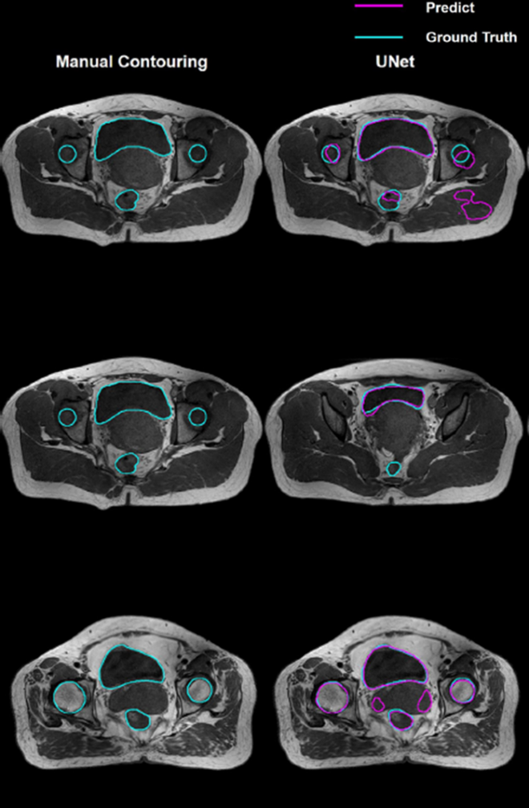

# Contorneo y segmentación automática de órganos

En la planificación radioterápica, los procesos de **contorneo** y **segmentación** se refieren a la identificación de regiones anatómicas de interés en las imágenes médicas del paciente. Aunque a veces se usan como sinónimos, en el ámbito clínico existe una sutil distinción entre ambos términos [38], [39] :

**•	Contorneo (contouring):**  
Se refiere típicamente al trazado manual de las fronteras de una estructura en las imágenes. El médico (u otro profesional) dibuja las líneas que delimitan, por ejemplo, el volumen tumoral macroscópico (GTV) o un órgano sano crítico (OAR) en cada corte de la tomografía. El resultado es un volumen delineado manualmente, basado en la interpretación visual experta de las imágenes. El contorneo es un proceso intensivo en tiempo y altamente dependiente de la experiencia del clínico, pudiendo variar entre distintos observadores. En el caso del cáncer de próstata, por ejemplo, el contorneo del volumen prostático y de órganos vecinos como la vejiga o el recto puede llevar considerable tiempo debido a que los límites no siempre son evidentes en la imagen CT estándar, especialmente si no hay contraste de tejidos; esto explica la frecuente incorporación de MRI para refinar este paso.

**•	Segmentación (segmentation):**   
Denota la partición de la imagen en regiones significativas de manera (semi)automática mediante herramientas computacionales. En lugar de delinear manualmente, el clínico puede valerse de algoritmos que identifican los píxeles o vóxeles correspondientes a cierta estructura. La segmentación puede ser totalmente automática (el software produce una máscara binaria de la estructura de interés en toda la imagen) o asistida, donde un operador guía el proceso. En radioterapia, la segmentación automática suele generar contornos preliminares de órganos o tumores, que luego pueden ser revisados y ajustados por el especialista antes de su uso en la planificación. 

Tanto el contorneo manual como la segmentación automática (ver **Figura 7**) persiguen el mismo fin: obtener delineaciones precisas de volúmenes blanco y órganos en riesgo para planificar adecuadamente la distribución de dosis. La precisión de estas delineaciones es crítica, pues errores en este paso se traducirán directamente en errores de tratamiento. Un contorno subestimado del tumor podría dejar fuera áreas cancerosas sin irradiar (comprometiendo la probabilidad de control tumoral), mientras que un contorno sobreestimado de un órgano sano podría conllevar restricciones excesivas de dosis que limiten injustificadamente la efectividad del plan, o peor aún, un contorno mal posicionado de un órgano podría hacer que se subestime la dosis real recibida por ese órgano, aumentando el riesgo de complicaciones no previstas. 

Por ejemplo, al delinear la próstata es fundamental incluir cualquier extensión extracapsular conocida; si esta no se contornea, el plan no cubrirá esa región con la dosis necesaria. Del mismo modo, contornear incorrectamente la pared rectal podría llevar a una evaluación imprecisa de la dosis que recibe, implicando riesgos de toxicidad inadvertidos [39].

  
  
<b>Figura 7:</b> Comparación entre un contorneo realizado por un oncólogo versus una segmentación realizada por un modelo de Deep Learning.

El **problema del tiempo y la variabilidad en el contorneo manual** ha sido ampliamente documentado. En entornos clínicos con altos volúmenes de pacientes, el personal médico puede invertir varias horas en delinear todas las estructuras relevantes en un solo caso de pelvis (próstata, vesículas seminales, vejiga, recto, cabezas femorales, intestino, etc.). Además, estudios han mostrado que la **variación interobservador** en estos contornos no es despreciable (distintos expertos pueden delinear el mismo órgano con diferencias significativas) lo cual introduce incertidumbre en la planificación. Esta variabilidad se debe tanto a interpretaciones subjetivas de límites anatómicos poco claros, como a diferencias en entrenamiento o criterio clínico [40].

Para mitigar estos desafíos, desde hace más de dos décadas se han desarrollado herramientas de contorneo asistido por computadora. Un enfoque tradicional fue la **segmentación basada en atlas**, en la cual una base de datos de imágenes con contornos previamente realizados (un “atlas” anatómico) se registra deformablemente al nuevo paciente, transfiriendo así los contornos de manera automática [41], [42], [43].

Este método puede acelerar la obtención de contornos, pero su precisión depende de qué tanto la anatomía del paciente coincide con la del atlas; errores de registración deformable pueden llevar a contornos inexactos. No obstante, en áreas como la pelvis hubo intentos exitosos de atlas probabilísticos para segmentar órganos pélvicos, con resultados mixtos en cuanto a exactitud[44] . 

