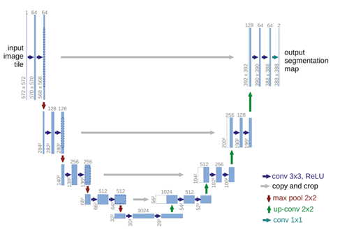

# Deep learning en imagenología médica

Paralelamente, emergieron métodos de **aprendizaje automático clásico (Machine Learning, ML)** para segmentación, por ejemplo, algoritmos basados en **random forest** o **máquinas de vectores de soporte (SVM)** que utilizaban descriptores de intensidad y textura diseñados manualmente para clasificar cada píxel/voxél como perteneciente o no a una estructura. Estos métodos lograron cierto grado de automatización, pero enfrentaron dificultades para generalizar a múltiples modalidades de imagen o anatomías distintas, debido a su dependencia en características específicas. En entornos de radioterapia, con imágenes CT de diferentes calidades y pacientes con anatomías variables, los algoritmos de ML tradicional resultaban frágiles ante cambios sutiles no contemplados en su fase de entrenamiento [39], [45].

En los últimos años, la irrupción del **aprendizaje profundo (Deep Learning, DL)** ha revolucionado el campo de la segmentación automática de órganos. Las redes neuronales profundas, en particular las **redes convolucionales (CNN)**, han demostrado ser capaces de aprender directamente de los datos características jerárquicas complejas, superando las limitaciones de la ingeniería manual de atributos[46], [47], [48]. 

Las arquitecturas de redes neuronales diseñadas para segmentación de imágenes suelen seguir un patrón de **encoder-decoder** (codificador-decodificador), donde en la primera mitad de la red se extraen características de alto nivel reduciendo progresivamente la resolución espacial, y en la segunda mitad se reconstruye una máscara segmentada a la resolución original, combinando la información contextual global con detalles locales. Dentro de este paradigma general, la arquitectura **U-Net** se ha consolidado como la arquitectura pionera y más influyente en segmentación biomédica [47]. 

La U-Net presenta una estructura en forma de “U” con múltiples niveles: cada paso de contracción (encoder) reduce la imagen mediante convoluciones y pooling para capturar patrones robustos, mientras que cada paso de expansión (decoder) realiza upsampling de las características para proyectarlas de nuevo al espacio de imagen, incorporando detalles finos mediante conexiones de salto (skip connections) provenientes del encoder. Estas conexiones de salto –que transfieren directamente mapas de activación de la fase de contracción a la fase de expansión del mismo nivel– son clave para preservar la información de bordes y detalles que de otro modo se perderían en la compresión, permitiendo segmentaciones precisas a nivel de píxel. 

La **Figura 8** ilustra la arquitectura típica de una U-Net, con su camino de codificación descendente y decodificación ascendente con fusión de características a través de atajos laterales.

  
  
<b>Figura 8:</b> Esquema general de la arquitectura U-Net para segmentación de imágenes biomédicas (adaptado de Ronneberger et al., 2015).

 
A pesar de los avances, es importante recalcar que incluso los modelos automáticos más precisos suelen ser utilizados como **apoyo al experto, no como reemplazo absoluto**. En la práctica clínica actual, la salida de un algoritmo de segmentación automática es revisada y editada por el oncólogo radioterápico antes de su aceptación final en el plan. 

Estudios reportan que, si bien la automatización puede ahorrar una cantidad significativa de tiempo (reduciendo el contorneo de horas a minutos) y mejorar la consistencia, la intervención del experto sigue cumpliendo un rol de control de calidad imprescindible, detectando eventuales errores en casos atípicos [49], [50], [51]. No obstante, conforme estas técnicas sigan refinándose y acumulando validación clínica, se espera que la confianza en ellas aumente y eventualmente permitan flujos de trabajo semiautónomos con mínima intervención humana.

En el contexto específico de la **radioterapia prostática y pélvica**, la segmentación automática de múltiples órganos a la vez (próstata, vesículas, vejiga, recto, etc.) es un desafío actualmente investigado. En esta región anatómica, los órganos están muy próximos entre sí y pueden cambiar de forma/tamaño según contenidos fisiológicos (vejiga llena vs vacía, recto con diferente distensión) [52], [53]. 

Estas variaciones añaden complejidad a la tarea de segmentación. Aun así, los resultados publicados son prometedores: los algoritmos basados en DL suelen lograr **coeficientes de Dice medios superiores a 0.85-0.90** para órganos grandes como la **vejiga**, en concordancia cercana al contorneo humano [53], [54]. 

Para estructuras más pequeñas o de bordes difusos (ej. **próstata en CT**), los desempeños son un poco inferiores (**Dice ~0.80-0.88**), pero en continua mejora con nuevas técnicas y con el uso de MRI para asistir la delineación automática [55].

Tras la introducción de U-Net, numerosas **variantes** han surgido para abordar distintas necesidades. Por ejemplo, la arquitectura **V-Net** adaptó la idea al caso tridimensional (segmentación en volúmenes 3D) usando convoluciones volumétricas, siendo muy aplicada en segmentación de órganos en estudios tomográficos o de resonancia volumétrica [56]. Otras extensiones incorporaron bloques de residuos (**ResUNet**) para facilitar el entrenamiento de redes más profundas [57], o mecanismos de atención (**Attention UNet**) que permiten a la red enfocarse adaptativamente en regiones de interés aprendidas, ignorando fondos irrelevantes [58]. Más recientemente, se han explorado **arquitecturas híbridas** que combinan CNN con componentes basados en **transformers** (redes originalmente desarrolladas en procesamiento de lenguaje natural) para modelar relaciones de larga distancia en la imagen, mejorando la consistencia global de la segmentación [59]. 

Cabe destacar también la contribución de la plataforma **nnU-Net**, propuesta por Isensee et al. (2021) [48], la cual no es una nueva arquitectura en sí, sino un marco **auto-configurable** que ajusta automáticamente los hiperparámetros y el diseño de la U-Net (2D vs 3D, profundidad de capas, resolución, etc.) para un conjunto de datos dado. El nnU-Net demostró un desempeño sobresaliente ganando múltiples desafíos de segmentación con mínima intervención humana, lo que subraya la importancia no solo de la arquitectura base sino de adaptar correctamente la configuración de la red y el pre/procesamiento a cada problema.

En resumen, las arquitecturas de DL para segmentación han evolucionado rápidamente, pero mantienen como núcleo la idea de codificación-decodificación con preservación de detalles mediante atajos. Herramientas como U-Net han probado su eficacia en radioterapia, y las mejoras actuales giran en torno a refinamientos (residual, atención, transformers) y a la adaptación a datos específicos (como hace nnU-Net). La disponibilidad de poder computacional (GPUs) y de conjuntos de datos anotados lo suficientemente grandes ha sido un factor catalizador para entrenar estas redes profundas. En la siguiente sección se detallan cómo evaluar cuantitativamente el desempeño de estos modelos, es decir, cuáles métricas se emplean para comparar la segmentación automática contra la referencia de un experto humano.

[← Anterior](04_segmentacion.html) | [Siguiente: Métricas de evaluación de desempeño →](06_metricas.html)
